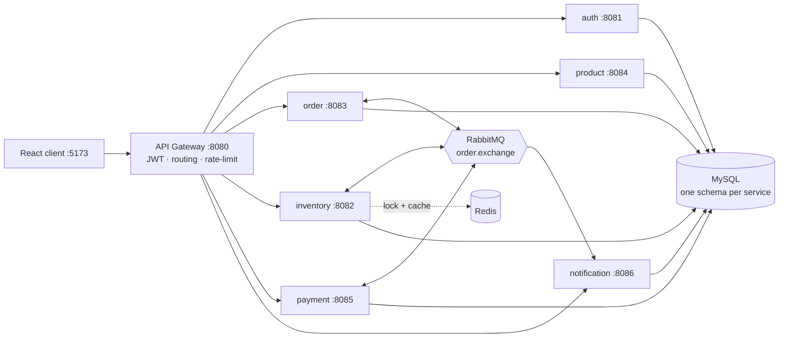
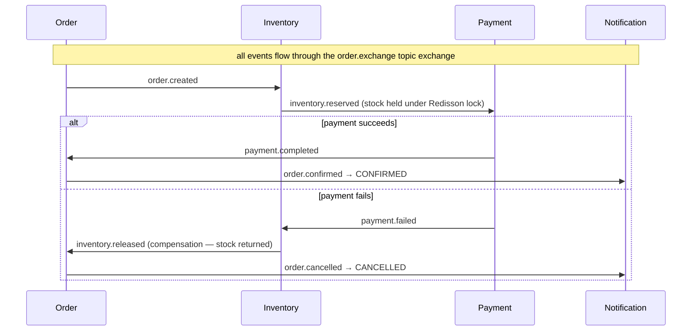

# OrderFlow

Event-driven order-processing platform. A checkout kicks off a **choreography saga** across
independent Spring Boot services that talk over **RabbitMQ** — no central orchestrator; each service
reacts to an event and emits the next one (or a compensating one). Every service owns its own MySQL
schema and communicates asynchronously.

## Architecture



The gateway is the **only** entry point (JWT validated at the edge, identity forwarded downstream).
Services never call each other synchronously — the saga is driven entirely by events.

## Saga flow (happy path + compensation)



Order lifecycle: `PENDING_PAYMENT → CONFIRMED | FAILED | CANCELLED`.

## Services

| Service | Port | Role | Owns |
|---|---|---|---|
| api-gateway | 8080 | Single entry: JWT validation, routing, Redis rate-limit, correlation IDs | — |
| auth-service | 8081 | Users + JWT issuance (HS256), RBAC | `auth_service` |
| product-service | 8084 | Catalog (public reads) | `product_service` |
| order-service | 8083 | Order lifecycle + saga coordinator | `order_service` |
| inventory-service | 8082 | Reserve/release stock, overselling guard | `inventory_service` |
| payment-service | 8085 | Simulated gateway (SUCCESS/FAILED/TIMEOUT) | `payment_service` |
| notification-service | 8086 | Email/SMS/push (simulated) + history | `notification_service` |
| `shared-events` · `shared-common` · `shared-security` | — | Event contracts · outbox+idempotency+RabbitMQ config · JWT | — |

## Key patterns (the "why")

- **Transactional Outbox** — a domain change and its event are written in one DB transaction; a poller
  publishes from the `outbox_event` table. No lost or ghost events despite the DB/broker dual-write.
- **Idempotent consumers** — every handler records the `eventId` in `processed_message` in the same
  transaction as its work, so RabbitMQ's at-least-once redelivery can't double-process.
- **Redisson distributed lock** (`inventory:product:{sku}`) held across the reserve transaction —
  prevents overselling under concurrency; a JPA `@Version` column is the second guard.
- **DLQ + retry** — each queue dead-letters to `order.dlx` after retries exhaust; poison messages are
  isolated, not lost.
- **Redis cache** for inventory reads (evict-on-write). **Micrometer → Prometheus → Grafana** for
  metrics; structured JSON logs carry a correlation ID end-to-end.

RabbitMQ topology, ER diagram and per-step sequences: see [docs/ARCHITECTURE.md](docs/ARCHITECTURE.md).

## Tech stack

Java 21 · Spring Boot 3.5 · Spring Cloud Gateway 2025 · Spring Data JPA · Spring Security (JWT) ·
RabbitMQ · Redis + Redisson · MySQL · Micrometer/Prometheus/Grafana · springdoc OpenAPI ·
JUnit 5 / Mockito / Testcontainers · Docker Compose · React + Vite + Tailwind.

## Local setup

Requires Java 21, Maven, Docker, Node 18+.

```bash
mvn clean install                 # build all modules + run tests
```

Run infra + services locally (RabbitMQ/Redis/MySQL). If you already run RabbitMQ/Redis natively,
start only MySQL (`docker compose up -d mysql`) and launch a service overriding the creds:

```bash
java -jar order-service/target/order-service-1.0.0.jar \
  --spring.rabbitmq.username=guest --spring.rabbitmq.password=guest --spring.data.redis.password=
```

Frontend: `npm --prefix frontend install && npm --prefix frontend run dev` → http://localhost:5173
(proxies `/api` to the gateway).

## Deployment (one command)

```bash
docker compose up --build
```

Brings up all 7 services + RabbitMQ, Redis, MySQL, Prometheus, Grafana. Services reach infra by
container DNS; payment outcome via `PAYMENT_MODE` (`RANDOM`|`ALWAYS_SUCCESS`|`ALWAYS_FAIL`).

| UI | URL |
|---|---|
| Gateway | http://localhost:8080 |
| RabbitMQ | http://localhost:15672 (orderflow/orderflow) |
| Prometheus | http://localhost:9090 |
| Grafana | http://localhost:3000 (admin/admin) |

> On a machine already running RabbitMQ/Redis natively, stop them first (ports 5672/6379 collide).

## API guide

All traffic goes through the gateway (`:8080`). Swagger UI per service at
`http://localhost:<port>/swagger-ui.html` (auth: `/api/swagger-ui.html`).

| Method | Path | Auth |
|---|---|---|
| POST | `/api/auth/register`, `/api/auth/login` | public |
| GET | `/api/v1/products` | public |
| POST | `/api/v1/products`, `/api/v1/inventory` | ADMIN |
| POST | `/api/v1/orders` | authenticated |
| GET | `/api/v1/orders/{orderId}`, `/api/v1/orders?userId=` | authenticated |
| GET | `/api/v1/notifications?userId=` | authenticated |

```bash
# 1. register → returns { accessToken, userId, ... }
TOKEN=$(curl -sX POST localhost:8080/api/auth/register -H 'Content-Type: application/json' \
  -d '{"email":"a@b.com","password":"secret123","role":"ADMIN","fullName":"A"}' | jq -r .accessToken)

# 2. seed stock (ADMIN)  3. place order  4. poll status → CONFIRMED / CANCELLED
curl -sX POST localhost:8080/api/v1/inventory -H "Authorization: Bearer $TOKEN" \
  -H 'Content-Type: application/json' -d '{"skuCode":"SKU-1","quantity":10}'
OID=$(curl -sX POST localhost:8080/api/v1/orders -H "Authorization: Bearer $TOKEN" \
  -H 'Content-Type: application/json' \
  -d '{"userId":1,"items":[{"skuCode":"SKU-1","quantity":2,"unitPrice":100}]}' | jq -r .data.orderId)
curl -s localhost:8080/api/v1/orders/$OID -H "Authorization: Bearer $TOKEN" | jq .data.status
```

## Future improvements

- Asymmetric JWT (RSA) so services validate with a public key instead of a shared secret.
- Discovery-based routing (`lb://`) or Kubernetes DNS instead of static gateway URIs.
- Outbox → CDC (Debezium) to drop the polling relay.
- SSE/WebSocket order updates instead of client polling.
- Contract tests across services; chaos/latency testing of the saga.
