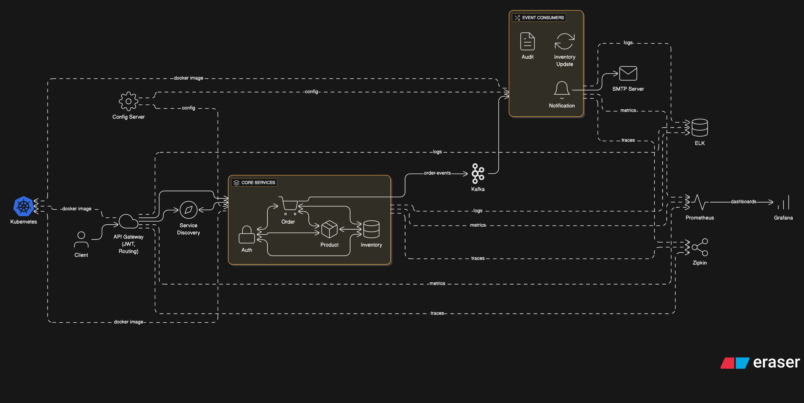

# 🛒 Orderly - Event-Driven Microservices E-Commerce Platform

<div align="center">


**A production-ready, event-driven microservices platform built with Spring Cloud ecosystem**

</div>

---

## 🎯 Overview

**Orderly** is a scalable e-commerce platform built using microservices architecture, demonstrating industry-standard patterns for distributed systems including service discovery, API gateway, event-driven communication, and comprehensive observability.

### ✨ Key Features

| Category | Features |
|----------|----------|
| **Service Communication** | Synchronous (REST/FeignClient) + Asynchronous (Apache Kafka) |
| **Resilience** | Circuit Breaker, Retry, Timeout, Rate Limiting (Resilience4j) |
| **Service Discovery** | Dynamic registration & health monitoring (Netflix Eureka) |
| **API Gateway** | Centralized routing, JWT authentication, rate limiting |
| **Configuration** | Externalized configuration with Spring Cloud Config |
| **Security** | JWT-based authentication, Spring Security, BCrypt encryption |
| **Observability** | Distributed tracing (Zipkin), Metrics (Prometheus/Grafana), Logging (ELK) |
| **Deployment** | Containerized with Docker, orchestrated on Kubernetes |

---

## 🏗 Architecture



### Data Flow

```
Client Request
      │
      ▼
┌─────────────┐     ┌─────────────┐     ┌─────────────┐     ┌─────────────┐
│ API Gateway │────►│   Eureka    │────►│Core Service │────►│  Database   │
│ (JWT + Rate │     │  Discovery  │     │             │     │ MySQL/Mongo │
│  Limiting)  │     └─────────────┘     └──────┬──────┘     └─────────────┘
└─────────────┘                                │
                                               ▼
                                        ┌─────────────┐
                                        │    Kafka    │
                                        │   Events    │
                                        └──────┬──────┘
                              ┌────────────────┼────────────────┐
                              ▼                ▼                ▼
                        ┌──────────┐    ┌──────────┐    ┌──────────┐
                        │  Audit   │    │ Inventory│    │  Email/  │
                        │  Logs    │    │  Update  │    │   SMS    │
                        └──────────┘    └──────────┘    └──────────┘
```

---

## 🔧 Microservices

| Service | Port | Description |
|---------|------|-------------|
| **[Auth Service](./auth-service)** | 8081 | User authentication, JWT token management, role-based access control |
| **[Order Service](./order-service)** | 8083 | Order processing with inventory validation, resilience patterns |
| **[Product Service](./product-service)** | 8084 | Product catalog with MongoDB, filtering & pagination |
| **[Inventory Service](./inventory-service)** | 8082 | Real-time stock management and availability validation |
| **API Gateway** | 8080 | Request routing, JWT validation, rate limiting |
| **Discovery Server** | 8761 | Service registration and health monitoring |
| **Config Server** | 8888 | Centralized configuration management |
| **Notification Service** | 8085 | Email/SMS notifications via Kafka events |

---

## 🛠 Technology Stack

### Backend
| Technology | Purpose |
|------------|---------|
| Java 21 | Programming Language |
| Spring Boot 3.2.5 | Application Framework |
| Spring Cloud 2023.0 | Microservices Infrastructure |
| Spring Security | Authentication & Authorization |

### Data Layer
| Technology | Purpose |
|------------|---------|
| MySQL 8.0 | Relational Database (Auth, Order, Inventory) |
| MongoDB 7.0 | Document Database (Product Catalog) |
| Spring Data JPA | ORM for MySQL |
| Spring Data MongoDB | ODM for MongoDB |

### Communication
| Technology | Purpose |
|------------|---------|
| OpenFeign | Declarative REST Client |
| Apache Kafka | Event Streaming Platform |
| Resilience4j | Fault Tolerance (Circuit Breaker, Retry, Timeout) |

### Infrastructure
| Technology | Purpose |
|------------|---------|
| Netflix Eureka | Service Discovery |
| Spring Cloud Gateway | API Gateway |
| Spring Cloud Config | Configuration Management |

### Observability
| Technology | Purpose |
|------------|---------|
| Zipkin | Distributed Tracing |
| Prometheus | Metrics Collection |
| Grafana | Metrics Visualization |
| ELK Stack | Centralized Logging |

### DevOps
| Technology | Purpose |
|------------|---------|
| Docker | Containerization |
| Kubernetes | Container Orchestration |
| Maven | Build Tool |

---

## 🚀 Getting Started

### Prerequisites

- Java 21+
- Maven 3.9+
- Docker & Docker Compose

### Quick Start

```bash
# Clone repository
git clone https://github.com/sanjaygupta45/Orderly.git
cd Orderly

# Start infrastructure (databases, Kafka, etc.)
docker-compose up -d

# Build all services
mvn clean install -DskipTests

# Run services
./start-services.sh
```

### Service Endpoints

| Service | URL |
|---------|-----|
| API Gateway | http://localhost:8080 |
| Eureka Dashboard | http://localhost:8761 |
| Zipkin UI | http://localhost:9411 |
| Grafana | http://localhost:3000 |
| Kibana | http://localhost:5601 |

---

## 📁 Project Structure

```
Orderly/
├── api-gateway/           # Spring Cloud Gateway
├── discovery-server/      # Netflix Eureka Server
├── config-server/         # Spring Cloud Config Server
├── auth-service/          # Authentication & Authorization
├── order-service/         # Order Processing
├── inventory-service/     # Stock Management
├── product-service/       # Product Catalog
├── notification-service/  # Event-driven Notifications
├── docker/                # Docker configurations
├── k8s/                   # Kubernetes manifests
├── docker-compose.yml     # Local development stack
└── pom.xml               # Parent POM
```

---

## 📄 License

This project is licensed under the MIT License.

---

<div align="center">

**Sanjay Gupta** • [GitHub](https://github.com/sanjaygupta45) • [LinkedIn](https://linkedin.com/in/sanjaygupta45)

</div>