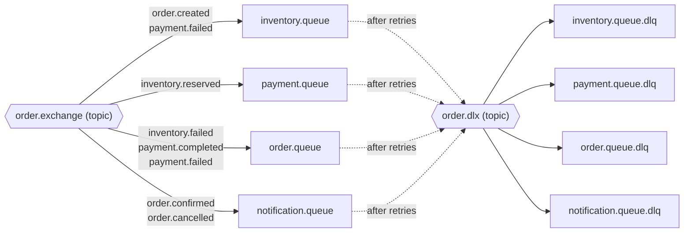
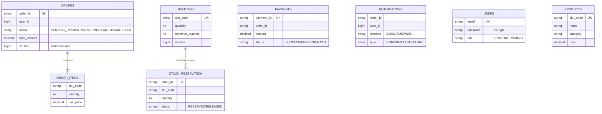

# OrderFlow — Architecture Deep-Dive

Companion to the [README](../README.md). Covers the messaging topology, data model, and the
reliability mechanics in detail.

## 1. RabbitMQ topology

One **topic exchange** carries all business events; each service owns one queue bound to the
routing keys it reacts to. Failed messages dead-letter to `order.dlx` after listener retries
(3 attempts, exponential backoff 1s → 10s).



| Routing key | Producer | Consumers | Meaning |
|---|---|---|---|
| `order.created` | order | inventory | new order → reserve stock |
| `inventory.reserved` | inventory | payment | stock held → charge |
| `inventory.failed` | inventory | order | no stock → order FAILED |
| `payment.completed` | payment | order | charge OK → order CONFIRMED |
| `payment.failed` | payment | inventory, order | charge failed → release stock, order CANCELLED |
| `inventory.released` | inventory | (audit) | compensation done |
| `order.confirmed` / `order.cancelled` | order | notification | notify the customer |
| `notification.created` | notification | (audit) | history entry written |

Messages are JSON; the producer stamps the event class in the `__TypeId__` header and the
consumer's `Jackson2JsonMessageConverter` maps it back (trusted package: `com.orderflow.shared.events`),
letting a single `@RabbitListener` dispatch by type via `@RabbitHandler`.

## 2. Event envelope

Every event extends `BaseEvent`: `eventId` (UUID, idempotency key) · `correlationId` (traces one
order across all services/logs) · `timestamp` · `version` (schema evolution) · `eventType` · `orderId`.

## 3. Reliability mechanics

**Transactional outbox** — handlers never publish directly. They write the domain change *and* an
`outbox_event` row in one local transaction; a scheduled relay (1s) publishes unpublished rows and
marks them. Crash before publish → relay retries; crash after commit → event survives. The DB/broker
dual-write problem disappears.

**Idempotent consumers** — first thing a handler does is `INSERT` the `eventId` into
`processed_message` (checked in the same transaction as the work). Redelivered duplicates hit the
existing row and are skipped, so at-least-once delivery yields exactly-once *effects*.

**Overselling guard** — reserve runs under a Redisson lock `inventory:product:{sku}` **held across
the DB commit** (multi-SKU orders acquire a sorted `multiLock` — no deadlocks). The `@Version`
column on `inventory` is a second, optimistic guard. Release needs no lock (it only adds stock back);
the `stock_reservation` rows make it exact and repeatable.

## 4. Data model (per-service schemas)



Plus in **every** event-handling schema: `processed_message` (event_id PK, event_type, processed_at)
and `outbox_event` (id, routing_key, payload JSON, published, created_at). Schemas are never shared;
the only integration surface is events.

## 5. Security

- auth-service issues **HS256 JWTs** (claims: `sub`=email, `userId`, `role`; 24h TTL).
- The **gateway** validates at the edge (401 before any service is touched), then forwards
  `X-User-Id` / `X-User-Role` / `X-Correlation-Id`.
- Each resource service **re-validates** the JWT itself (`shared-security` filter) — zero-trust:
  a service reached directly without a token still answers 401/403.
- Roles: catalog reads public; `POST /products`, `POST /inventory` require `ADMIN`; everything else
  requires an authenticated user. Trade-off noted for the future: RSA keys would let services verify
  with a public key only.

## 6. Observability

- **Metrics** (Micrometer → Prometheus, Grafana dashboard provisioned): business counters
  `orderflow.orders.total/confirmed/cancelled/failed`, `orderflow.inventory.reserved/released/reservation_failed`,
  `orderflow.payment.success/failed`, `orderflow.notifications.sent{channel,type}` + JVM/HTTP/AMQP.
- **Logs**: structured JSON (ECS) when `LOG_FORMAT=ecs`; every line carries the `correlationId`,
  which also travels in event payloads and AMQP headers — one grep follows an order end-to-end.
- **Health**: `/actuator/health` everywhere (DB/Rabbit/Redis contributors included).

## 7. Folder structure

```
orderflow/
├── shared-events/          # event contracts + Exchanges/RoutingKeys constants
├── shared-common/          # outbox, idempotency, RabbitMQ config, correlation, ApiResponse
├── shared-security/        # JwtService + servlet filter (optional dep for the reactive gateway)
├── api-gateway/            # Spring Cloud Gateway (webflux): JWT, routes, rate-limit
├── auth-service/           # users + JWT issuance
├── product-service/        # catalog
├── order-service/          # order lifecycle + saga
├── inventory-service/      # stock + Redisson lock + cache
├── payment-service/        # simulated gateway
├── notification-service/   # channels + history
├── frontend/               # React + Vite + Tailwind client
├── docker/                 # prometheus + grafana provisioning
├── mysql/init.sql          # creates the per-service schemas
├── Dockerfile              # one parameterized multi-stage build (ARG SERVICE)
└── docker-compose.yml      # full platform, one command
```

## 8. Design trade-offs

| Choice | Why | Alternative |
|---|---|---|
| Choreography saga | fewer moving parts, services stay autonomous | orchestrator (Camunda/temporal) for complex flows |
| Outbox + poller | simple, DB-only guarantee | CDC (Debezium) — no polling latency |
| HS256 shared secret | matches existing auth, simple rotation story | RSA/JWKS — services need only the public key |
| Static gateway routes | deterministic in Docker/K8s (DNS) | discovery + `lb://` (Eureka was removed as dead weight) |

**Industry note:** client-side registries like Eureka are legacy — today the platform does the
discovery. **Kubernetes Services + DNS** is the current standard, and it is exactly what our static
container-name routing maps to. A Kubernetes deployment is the planned next step (see README →
Future improvements).
| Client polling | simplest correct UX for status | SSE/WebSocket push |
